# README

## 项目简介

本项目基于 Python 开发完成，最初实现了月球 DEM 数据的加载、经过纬度矫正的坡度计算以及经过正射投影的图像显示。在此基础上，进一步添加了撞击坑区域的提取与绘制、最大深度与最大坡度的量化、坑缘点到坑底的视线遮挡分析，以及沿坑缘按固定角度遍历的批量遮挡统计的功能。


## 环境依赖

本项目依赖于以下环境库：

- numpy
- matplotlib
- tkinter
- rasterio
- pyproj
- affine
- scipy

其中通过 Anaconda 导出的环境配置已保存于 environment.yml 文件中，通过运行

```bash
conda env create -f environment.yml
```

完成配置环境，并通过运行主程序 main.py 进行启动。


## 项目结构

```
moon_dem/
├── main.py                      程序入口，启动 GUI
├── gui/
│   └── dem_window.py            tkinter 界面与按钮事件
└── functions/
    ├── load_dem.py              读取 地形数据，提取元数据
    ├── geo_utils.py             坐标/距离/方位/投影的基础工具
    ├── calc_slope.py            坡度计算
    ├── crop_region.py           撞击坑区域裁剪
    ├── analyze_crater.py        最大深度 / 最大坡度的计算
    ├── line_of_sight.py         视线遮挡 + 坑缘遍历
    └── show_map.py              绘图功能
```

项目结构经过整理实现了自下而上的依赖链：`geo_utils`→ 各功能模块 → `show_map` → `dem_window`。所有「经纬度 ↔ 像素 ↔ 米 ↔ 投影坐标」的换算都集中在 `geo_utils`，其余模块只调用、不重复实现。


## 数据准备

再使用SLDEM数据的过程中，其数据原生采用采用 0–360°E 的经度约定，因此需要将任务中给出的的坑底中心 `-58.7061` 换算为 `301.2939°E`（360 − 58.7061），点 A `-58.6971` 换算为 `301.3029°E`，两者的纬度不变。

使用前需要将整幅使用前需把整幅瓦片裁成坑附近的小块 GeoTIFF，并统一为地理经纬度坐标系 `+proj=longlat +R=1737400`，使 `load_dem.py` 能正确判定单位为 `degrees`。


## 项目过程

### 加载数据

首先，我了解到 .tif 格式的数据保存的包括高程的矩阵数据和元数据 meta data，故在加载数据的部分主要要进行的是对元数据的提取。由于数据同时可能是使用角度度数作为单位的也可能是使用米数作为单位的，首先需要进行区分。最终提取得到的元数据，包括变形矩阵、CRS 和单位等关键信息。

```python
meta_data = {
    "data": data,
    "transform": file.transform,
    "crs": file.crs,
    "width": file.width,
    "height": file.height,
    "bounds": file.bounds,
    "nodata": file.nodata,
    "units": unit_label,
    "radius": radius
}
```


### 计算坡度

对于坡度的计算，此处直接使用 np.gradient 函数得到原始图像的梯度，再对使用米作为单位和使用度数作为单位分情况讨论。

数学上，把月球当作半径 R 的球：沿纬线方向走 1° 是大圆弧长，恒为 `πR/180`；沿经线方向走 1° 则是纬度 φ 处的小圆弧长，为 `πR/180 · cosφ`，越靠两极越短。对于使用度数作为单位的数据，Y 方向（南北）只需用月球半径计算 米/度 再乘分辨率得到 米/像素；X 方向（东西）则需额外乘以各自纬度的缩放因子 cosφ。

```python
mpd = meters_per_degree(radius)          # 1° 对应的米数
mpp_y = res_y * mpd                       # Y 方向 米/像素（常数）

latitudes = transform.f + transform.e * (row_indices + 0.5)
scale = np.cos(np.deg2rad(latitudes))     # 各行的 cosφ
mpp_x = (res_x * mpd * scale)[:, np.newaxis]   # X 方向 米/像素
```

将原始梯度除以各方向的 米/像素 得到真实斜率，再取反正切得到坡度角：

```python
slope_x = raw_grad_x / mpp_x
slope_y = raw_grad_y / mpp_y
tan_slope = np.sqrt(slope_x ** 2 + slope_y ** 2)
slope_degrees = np.degrees(np.arctan(tan_slope))
```


### 显示图像

图像的坐标首先需要使用 meta data 中的 transform 矩阵对原始像素的 meshgrid 进行转换以完成坐标的还原。最开始我是用此种方法直接进行了绘图。但是随后通过与专业库 rasterio 中的对比我发现这样不经处理绘制出的图像会导致图象被强制拉伸成方形，完全变形。

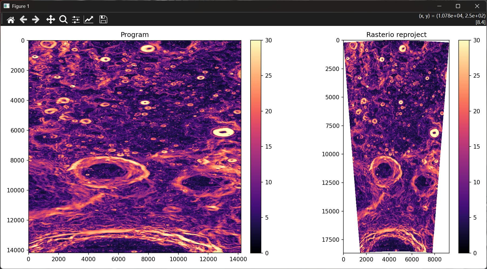

随后我尝试根据不同方向的比例进行还原，但是简单地使用 matplotlib 进行比例缩放绘制出的图像还是只有比例进行了大致还原没有实际意义。

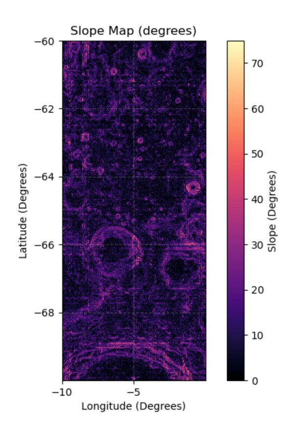

最后为了实现图像的正射投影，我使用了 pyproj 函数，以研究区中心为切点建立正射投影坐标系，把每个像素摆到它在切平面上的真实米制位置，从而局部保形保距。为保证后续叠加的点线与栅格严丝合缝，我把投影变换抽成单一来源 `build_geo_transformer`，栅格用 `build_projected_grid`、叠加点用 `project_points`，二者共用同一个变换器。

```python
center_lon = c + (width / 2.0) * a
center_lat = f + (height / 2.0) * e
src_crs = CRS.from_dict({'proj': 'longlat', 'a': radius, 'b': radius, 'no_defs': True})
proj_crs = CRS.from_dict({'proj': 'ortho', 'lat_0': center_lat, 'lon_0': center_lon,
                          'a': radius, 'b': radius, 'units': 'm', 'no_defs': True})
transformer = Transformer.from_crs(src_crs, proj_crs, always_xy=True)
```


### 撞击坑裁剪

整幅 SLDEM 瓦片像素极多，而研究对象只有半径约 300 m 的一小圈，因此我先把数据裁成坑附近的小块。由于数据原始分辨率约为 59m，裁剪后像素数大大减少，也减少了绘制所需的时间。

裁剪时用 `geo_utils` 的换算把「半径多少米」折算成「经纬度跨多少度」框出窗口，切片后把仿射变换平移到新原点：

```python
new_transform = meta_data['transform'] * Affine.translation(col_min, row_min)
```


### 深度与坡度分析

在裁好的小块里，我用一个圆掩膜 `circle_mask` 只保留距圆心 ≤ 半径的像素，在其中取最高点（坑缘）减最低点（坑底）作为最大深度；最大坡度则复用坡度图，在同一圆掩膜内取最大值。掩膜留有余量，避免梯度在边缘的一阶误差影响结果。

```python
rows = np.arange(height)[:, np.newaxis]
cols = np.arange(width)[np.newaxis, :]

lon = transform.c + transform.a * (cols + 0.5) + transform.b * (rows + 0.5)
lat = transform.f + transform.d * (cols + 0.5) + transform.e * (rows + 0.5)

dist = surface_distance(meta_data, lon0, lat0, lon, lat)
return dist <= radius
```


### 视线遮挡分析

此处我将 A 与中心都看作三维点，二者的连线是一条直线。在直线中进行等距采样，比较采样点的高度与真是地形高度来判断是否被遮挡：

- 视线高度按真实水平距离线性插值：`z_los = z_A + t·(z_C − z_A)`，t 为已走水平距离占总距离的比例。
- 真实地形高度由 DEM 双线性插值（`scipy.ndimage.map_coordinates`）取得。
- 若中间某点地形高出视线（`poke = 地形 − 视线 > clearance`），则被遮挡，冒得最高者为主遮挡物，其到坑底的水平距离即所求。

在实际实现中，由于`geo_to_pixel`（角点基准）与采样点之间存在半像素约定差，会让剖面起点偏移并产生如图中所示的虚假折返，故采样索引统一减 0.5，采样点经纬度直接用端点线性插值，使采样点 0 严格等于观测者。

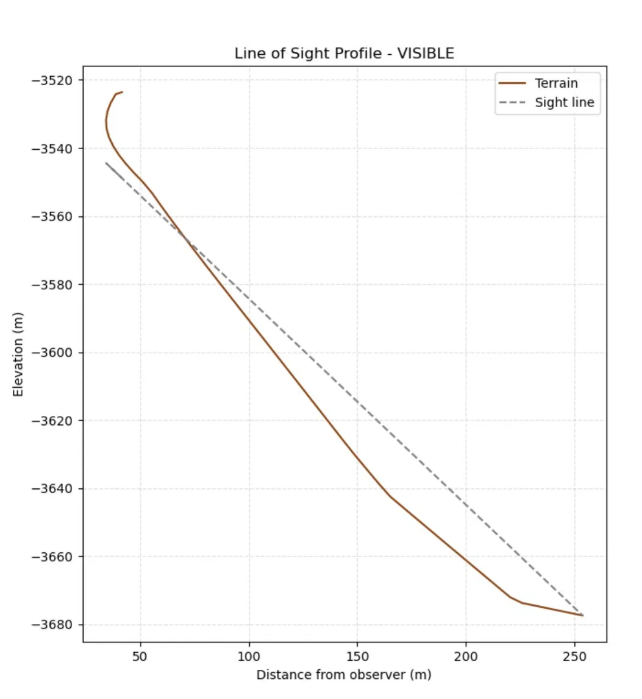

`clearance` 参数用于容忍 DEM 垂直噪声（SLDEM 约 3–4 m），在 UI 界面中可进行调节设置。


### 坑缘遍历

以 A 相对坑底中心的方位角为起点，每隔固定角度（默认 10°）在半径处取一个坑缘点，对每个点重复上面的视线分析，统计哪些方向可视、哪些被遮挡及对应距离。角度的计算在 `bearing_between` 中完成，而根据角度再反算出经纬度由 `geo_offset` 完成：

```python
def bearing_between(meta_data, lon0, lat0, lon1, lat1):
    east, north = to_local_xy(meta_data, lon0, lat0, lon1, lat1)
    return np.degrees(np.arctan2(east, north)) % 360.0


def geo_offset(meta_data, lon0, lat0, distance, bearing_deg):
    mpd = meters_per_degree(meta_data['radius'])
    b = np.deg2rad(bearing_deg)
    east = distance * np.sin(b)
    north = distance * np.cos(b)
    lon = lon0 + east / (mpd * np.cos(np.deg2rad(lat0)))
    lat = lat0 + north / mpd
    return lon, lat
```


### 操作界面

本项目使用的 GUI 界面为 python 自带的基础库 tkinter，其左侧的 Load File 实现点击后选择文件进行读取，Show DEM 在点击后显示出高程图。点击 Calc Slope 完成坡度的计算和显示。其最终结果如图：

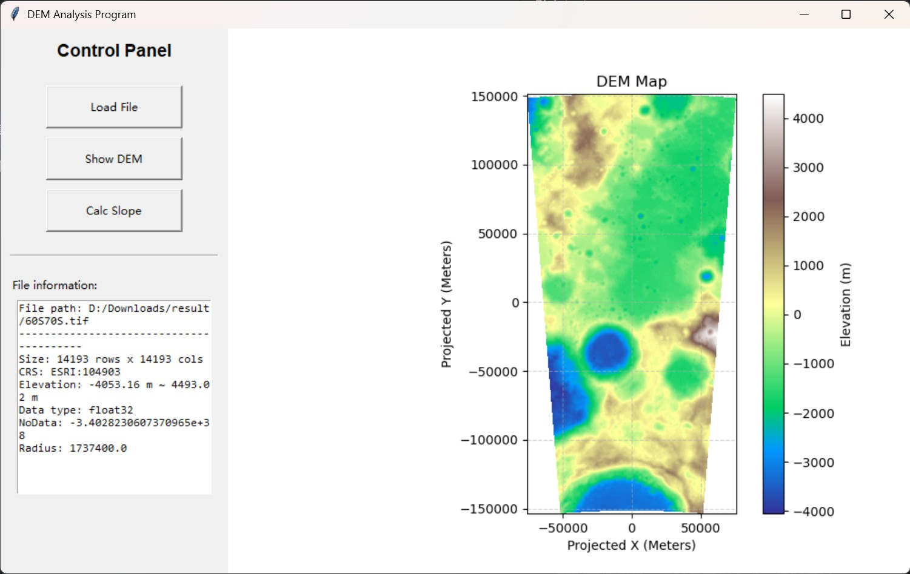

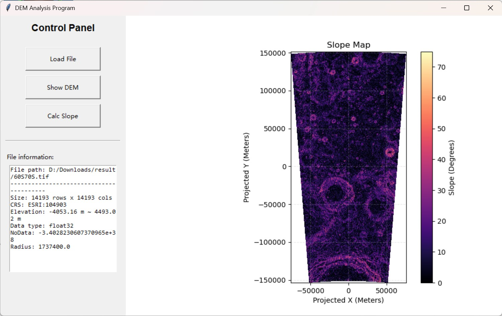

------

在完成更新后，新增加了多个输入框用以设置坑中心、半径、点 A、遍历角度步长与视线宽容度 Clearance。按钮 Crop & Show Crater 裁出坑并绘制，Analyze Depth/Slope 输出深度与坡度，Sight A→Center 给出单条视线的剖面与判定，Traverse Edges 给出绕坑一圈的批量结果。

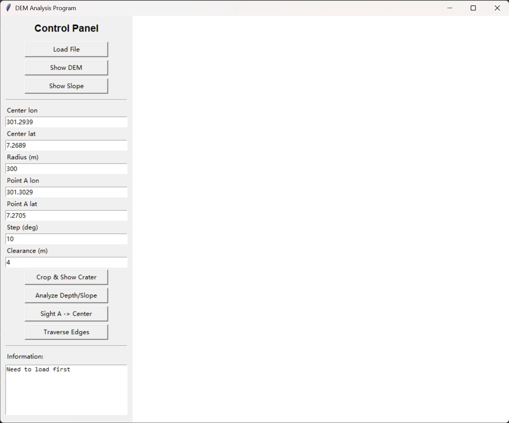


## 实验结果

> 以下为对中心 `301.2939°E, 7.2689°N`、半径约 300 m 撞击坑的分析结果。

### 整幅 DEM 与坡度图

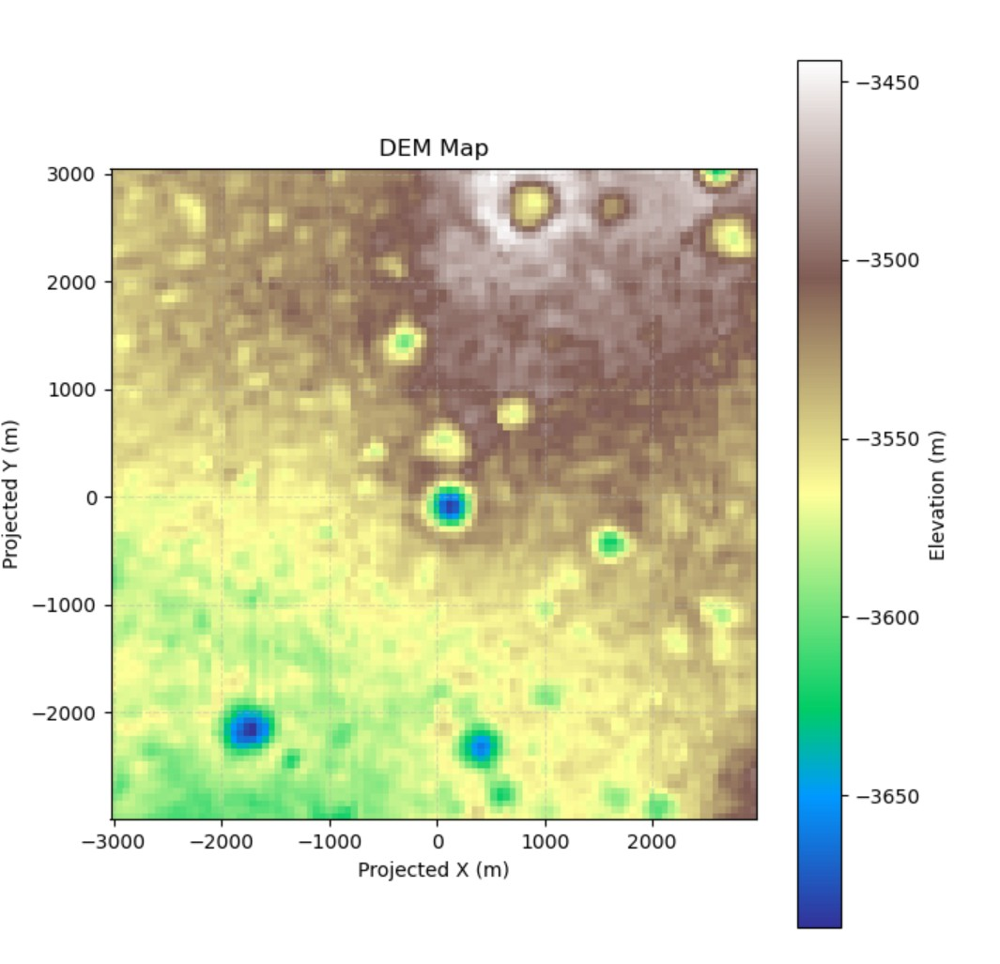

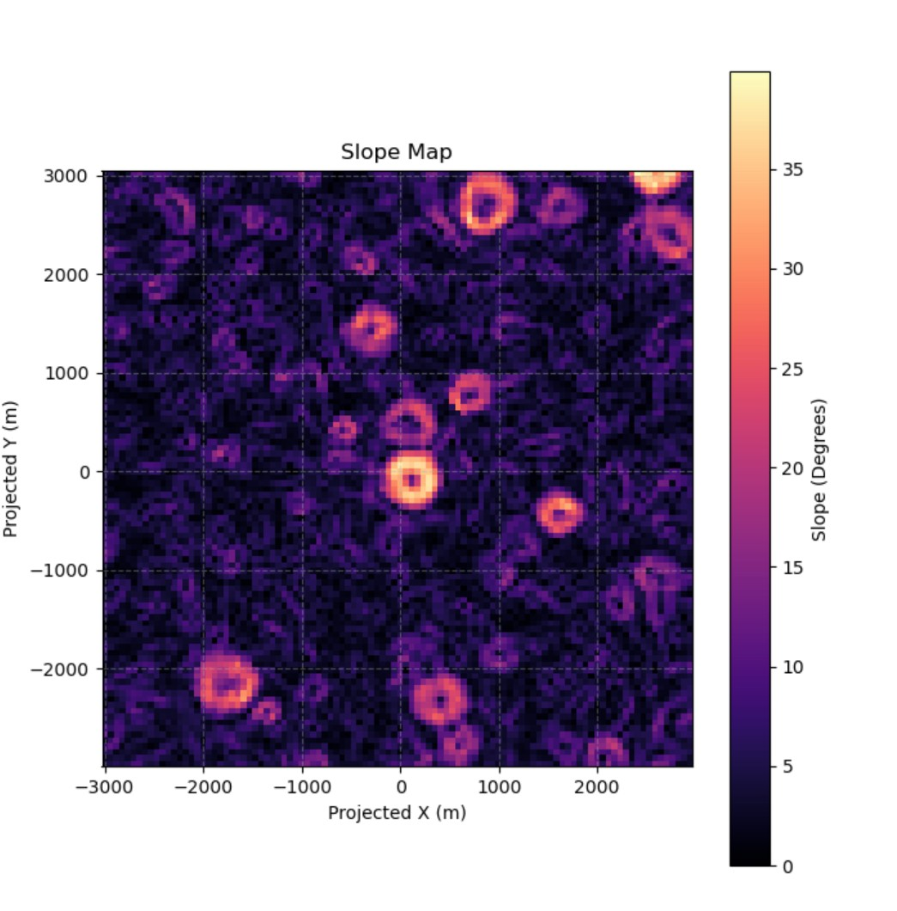


### 撞击坑提取与分析

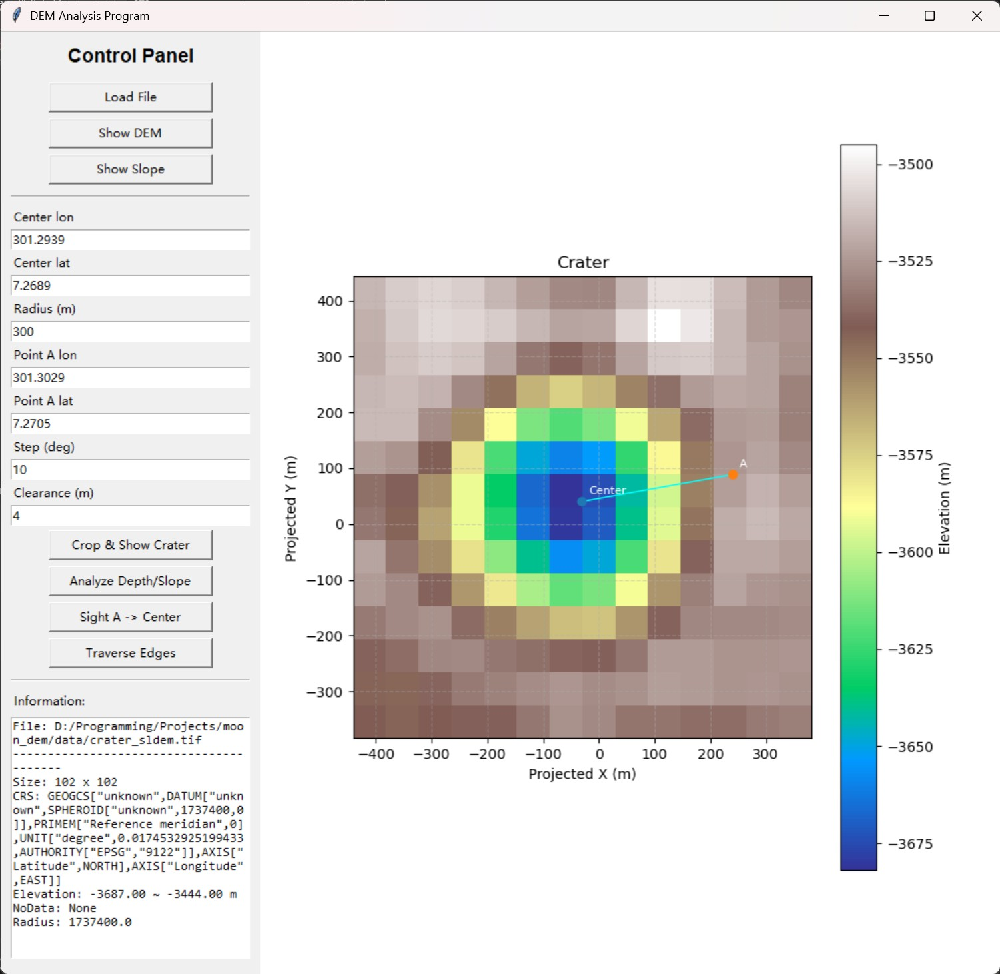

> Crater analysis
> ----------------------------------------
> Floor elev : -3682.00 m
> Rim elev   : -3511.00 m
> Max depth  : 171.00 m
> Max slope  : 38.34 deg
> Pixels used: 81

结果显示最大深度约 171 m，最大坡度约 38°，圆内像素约 81 个。而计算中半径 300 m ÷ 59 m/像素 ≈ 5 像素，圆面积 π·5² ≈ 81，与像素数吻合。


### 视线遮挡

从图中可以看到，由于数据精度的问题，在数据中使用了一定的宽容度 `clearance` 来过滤可能存在的由线性插值导致的噪声。当宽容度设置为 4m 时，A 点判定为未遮挡，绕坑一周也有许多点判定为未被遮挡。

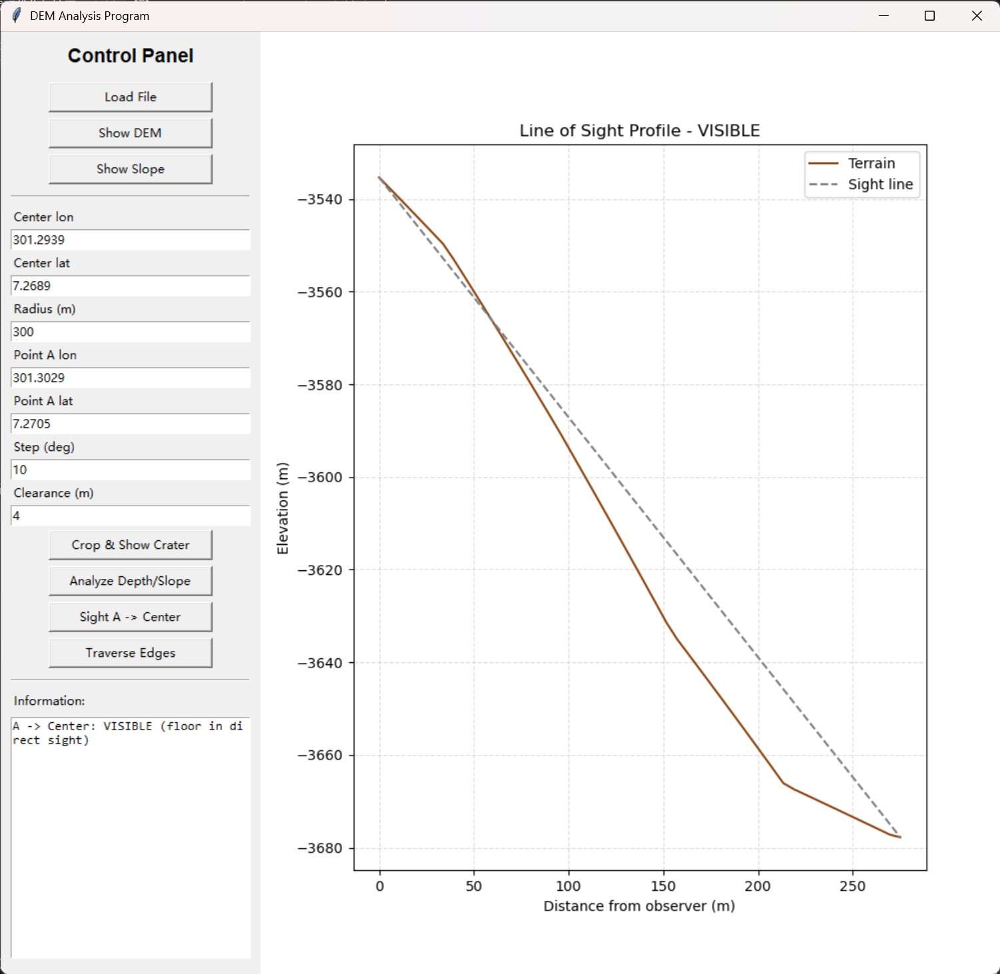

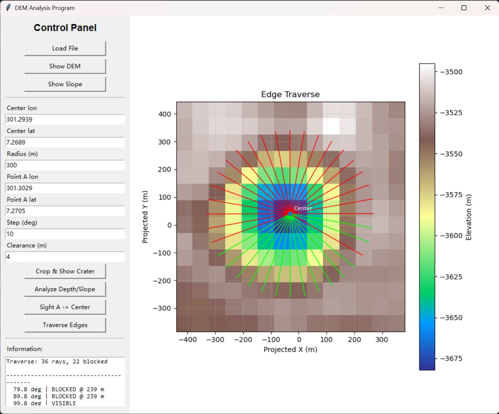

而如果收紧约束将宽容度设置为 0，则明显有更多的点被判定为视线遮挡。

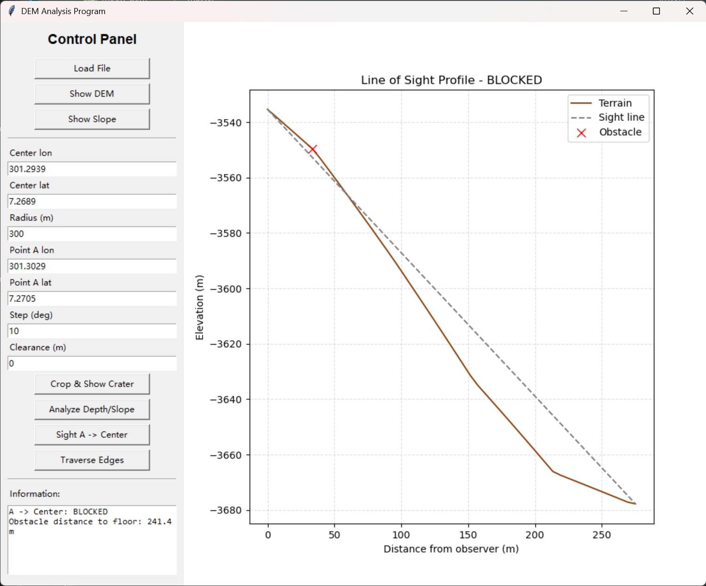

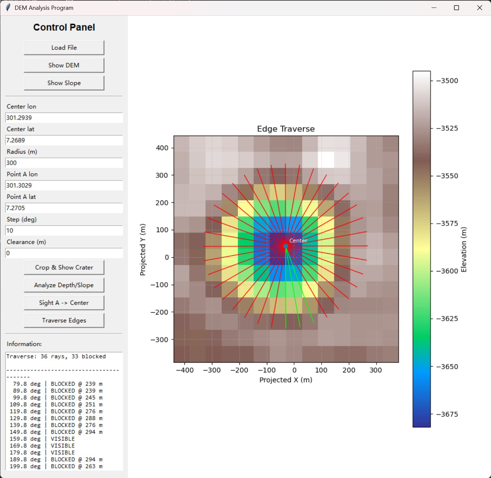


## 总结

项目总体进行了代码结构的拆分增加了复用度来理清结构，而对于 SLDEM 撞击坑的任务限制则在于分辨率。由于数据约 59 m/像素，该坑仅约 10 像素跨度，分析深度和坡度还尚可但是对于视线遮挡就存在一定的宽容度需求了。虽然此处添加了插值采样和端点的处理但是仍然是一种缺陷，对噪声敏感。